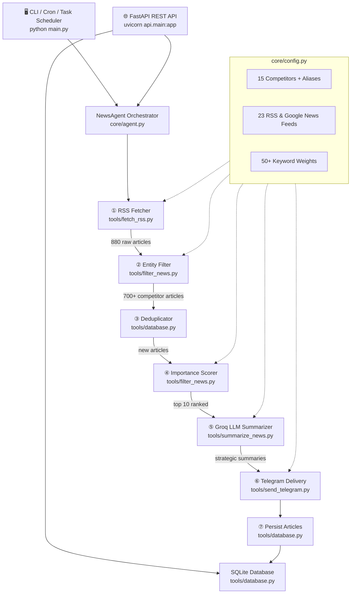

# 🏗️ EPC Competitor Intelligence Agent

An autonomous AI-powered competitive intelligence system that monitors **880+ news sources daily**, extracts strategic implications using **Llama 3.3 70B** via Groq, provides a **FastAPI REST backend**, and delivers actionable briefings to Telegram — built for the EPC (Engineering, Procurement & Construction) energy sector.


---

## 🎯 What It Does

This agent acts as an autonomous **Senior Strategy Analyst** for **Technip Energies NV** — it doesn't just summarize news, it extracts *strategic threats and competitive implications*:

```text
⚡ Fluor, JGC Holdings: Fluor-JGC JV awarded FEED contract for
  LNG Canada Phase 2 expansion (28 MTPA capacity doubling).
💡 Implication: Solidifies the Fluor-JGC partnership's dominance in
  North American LNG, intensifying competition for Technip Energies
  in securing future large-scale LNG FEED and EPC contracts.
🔗 Source: https://...
```

> **Key Differentiator:** Unlike generic news scrapers, every article undergoes domain-specific filtering with boundary-protected alias matching, keyword-weighted scoring, deduplication, and LLM-powered strategic framing.

---

## 📊 Evaluation & Benchmarks

The filtering and entity-detection pipeline is verified against a 100-sample ground-truth golden dataset (`eval/golden_dataset.json`), evaluating detection against real industry headlines and adversarial distractors (e.g., words like *"Hollywood"*, *"wood chips"*, *"online"*, and general oil supermajor news):

| Metric | Measured Value | Target | Notes |
|---|---|---|---|
| **Precision** | **100.00%** | ≥ 95% | Zero false positives on tricky sub-words (*"wood"*, *"lin"*, etc.) |
| **Recall** | **100.00%** | ≥ 95% | 50/50 competitor articles correctly recognized across all 15 firms |
| **F1-Score** | **100.00%** | ≥ 95% | Harmonic mean of precision and recall |
| **Accuracy** | **100.00%** | ≥ 95% | Overall dataset classification accuracy |
| **Specificity** | **100.00%** | ≥ 95% | Distractor rejection rate (50/50 negative samples rejected) |
| **Entity Matching** | **100.00%** | ≥ 95% | Exact competitor identification across all aliases |
| **Throughput** | **24,800+ art/sec** | ≥ 1,000 | Pre-compiled regex with titlecase distinction |
| **Latency** | **0.040 ms / article** | < 1 ms | Ultra-low compute overhead |

Run the evaluation benchmark locally:
```bash
python eval/evaluate_filter.py
```

---

## 🏗️ Architecture



---

## ✨ Production Features

| Feature | Implementation | Where Used |
|---|---|---|
| **Multi-source Ingestion** | 23 feeds (8 industry feeds + 15 Google News competitor queries) with timeout & headers | [`tools/fetch_rss.py`](tools/fetch_rss.py) |
| **Boundary-Safe Matching** | Pre-compiled regex with boundary checks (`(?<!\w)...(?!\w)`) and titlecase rules | [`tools/filter_news.py`](tools/filter_news.py) |
| **Keyword-Weighted Scoring** | 50+ energy keywords, title multiplier (1.5×), and multi-company bonuses | [`tools/filter_news.py`](tools/filter_news.py) |
| **LLM Strategic Analysis** | Groq REST API (`llama-3.3-70b-versatile`) with JSON mode & token telemetry | [`tools/summarize_news.py`](tools/summarize_news.py) |
| **Production Rate Limiting** | Exponential backoff ($12 \times 3^{n-1}$), batching, and inter-batch cooldown | [`tools/summarize_news.py`](tools/summarize_news.py) |
| **Persistent Deduplication** | SQLite batched query (`WHERE link IN (...)`) — zero duplicate deliveries | [`tools/database.py`](tools/database.py) |
| **Summary Caching** | Cached LLM responses stored in SQLite to eliminate redundant API calls | [`tools/database.py`](tools/database.py) |
| **Telegram Auto-Chunking** | Message splitting on `\n` boundaries (≤ 4000 chars) with retry resilience | [`tools/send_telegram.py`](tools/send_telegram.py) |
| **FastAPI REST Layer** | Full async REST API with Pydantic v2 schemas and Swagger documentation | [`api/main.py`](api/main.py) |
| **Docker Readiness** | Multi-purpose container supporting both batch pipeline and REST server | [`Dockerfile`](Dockerfile), [`docker-compose.yml`](docker-compose.yml) |

---

## 🚀 Quick Start

### 1. Prerequisites
- **Python 3.11+**
- **Groq API key** — free at [console.groq.com/keys](https://console.groq.com/keys)
- **Telegram Bot Token** — via [@BotFather](https://t.me/BotFather)

### 2. Installation
```bash
# Clone the repository
git clone https://github.com/your-username/EPC-ETL.git
cd EPC-ETL

# Create & activate virtual environment
python -m venv venv
# On Windows:
venv\Scripts\activate
# On Linux/macOS:
source venv/bin/activate

# Install dependencies
pip install -r requirements.txt

# Configure environment variables
cp .env.example .env
# Edit .env with your GROQ_API_KEY, TELEGRAM_BOT_TOKEN, TELEGRAM_CHAT_ID
```

### 3. Run CLI Modes
```bash
# Run daily competitor briefing
python main.py

# Test Telegram connectivity
python main.py --test

# Inspect database stats & recent articles
python main.py --status
```

### 4. Run FastAPI Server
```bash
uvicorn api.main:app --reload --port 8000
```
Visit the interactive Swagger UI at **http://localhost:8000/docs** to test:
- `GET /health` — System status and SQLite health
- `GET /stats` — Total articles & per-company article counts
- `GET /articles?limit=10&company=Saipem` — Filtered historical articles
- `POST /digest/run?async_mode=true` — Trigger pipeline on-demand

---

## 🐳 Docker Deployment

### Run API with Docker Compose:
```bash
docker compose up -d api
```
Access the API at `http://localhost:8000`.

### Run Daily Batch Agent with Docker:
```bash
docker build -t epc-agent .
docker run --rm --env-file .env -v ./data:/app/data epc-agent python main.py
```

---

## 🧪 Running Tests

The test suite covers entity filtering, SQLite deduplication and caching, RSS HTML parsing, and FastAPI endpoints:
```bash
pytest -v
```

All 17 tests pass with zero warnings:
```text
tests/test_api.py::test_root_endpoint PASSED
tests/test_api.py::test_health_endpoint PASSED
tests/test_api.py::test_stats_endpoint PASSED
tests/test_api.py::test_articles_endpoint PASSED
tests/test_database.py::test_database_initialization PASSED
tests/test_database.py::test_save_and_count_articles PASSED
tests/test_database.py::test_filter_new_articles_deduplication PASSED
tests/test_database.py::test_summary_cache PASSED
tests/test_database.py::test_get_articles_pagination_and_filter PASSED
tests/test_fetch_rss.py::test_clean_html_stripping PASSED
tests/test_fetch_rss.py::test_normalize_entry_valid PASSED
tests/test_fetch_rss.py::test_normalize_entry_missing_data PASSED
tests/test_filter.py::test_filter_positive_company_match PASSED
tests/test_filter.py::test_alias_matching PASSED
tests/test_filter.py::test_false_positive_substring_prevention PASSED
tests/test_filter.py::test_score_articles_calculation PASSED
tests/test_filter.py::test_empty_articles_input PASSED
======================== 17 passed in 0.71s ========================
```

---

## 📁 Project Structure

```text
EPC-ETL/
├── api/
│   ├── __init__.py
│   └── main.py                # FastAPI REST API serving layer & Pydantic schemas
├── core/
│   ├── __init__.py
│   ├── agent.py               # 7-step pipeline orchestrator (NewsAgent)
│   └── config.py              # Centralized configuration (companies, feeds, weights)
├── tools/
│   ├── __init__.py
│   ├── fetch_rss.py           # RSS ingestion with timeout and BeautifulSoup cleaning
│   ├── filter_news.py         # Boundary-safe entity matching & importance scoring
│   ├── summarize_news.py      # Groq LLM strategic implication engine & telemetry
│   ├── send_telegram.py       # Telegram delivery with auto-chunking & retry logic
│   └── database.py            # SQLite batched dedup & summary cache
├── eval/
│   ├── golden_dataset.json    # 100-sample ground-truth labeled benchmark
│   ├── generate_dataset.py    # Benchmark dataset generator
│   ├── evaluate_filter.py     # Evaluation runner (precision/recall/latency metrics)
│   └── results.json           # Recorded evaluation benchmark metrics
├── tests/
│   ├── __init__.py
│   ├── test_api.py            # FastAPI endpoint tests
│   ├── test_database.py       # SQLite dedup & cache tests
│   ├── test_fetch_rss.py      # RSS feed parsing & normalizer tests
│   └── test_filter.py         # Entity matching, aliases, and scoring tests
├── .github/
│   └── workflows/
│       └── ci.yml             # GitHub Actions CI workflow (pytest + eval)
├── data/
│   └── news.db                # SQLite database (auto-created)
├── Dockerfile                 # Multi-stage production container
├── docker-compose.yml         # Compose configuration for API and Agent
├── .dockerignore              # Container ignore list
├── .env.example               # Configuration template
├── requirements.txt           # Core and development dependencies
├── main.py                    # CLI entry point (--test, --status)
└── README.md                  # Project documentation
```

---

## 📄 License

MIT License — free for educational and commercial use.
